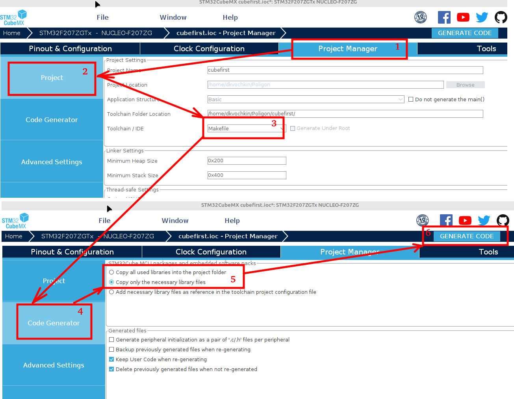
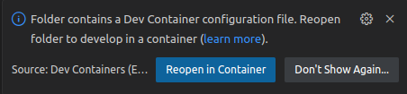
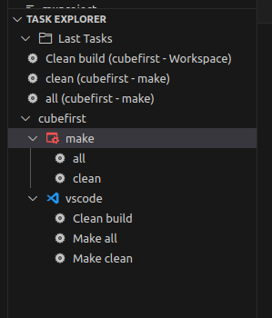
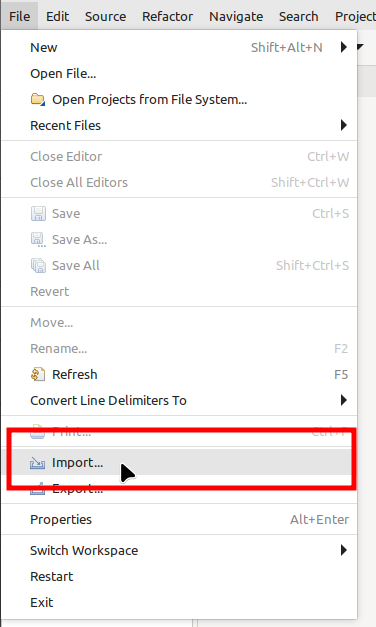
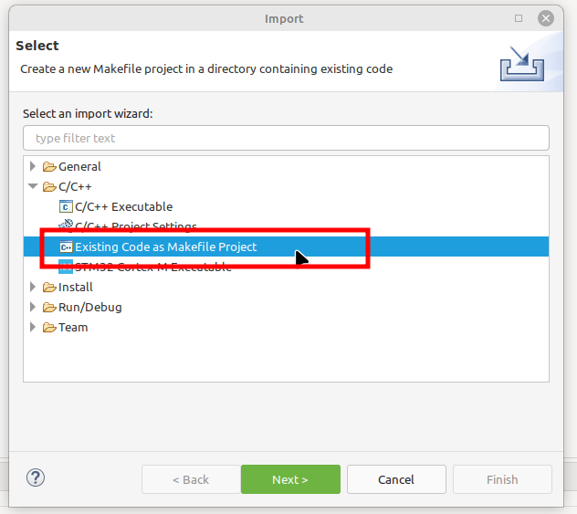
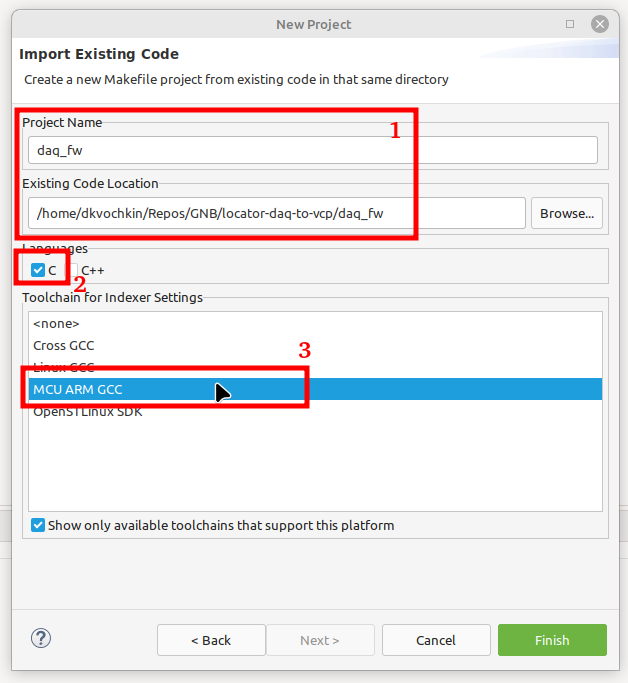
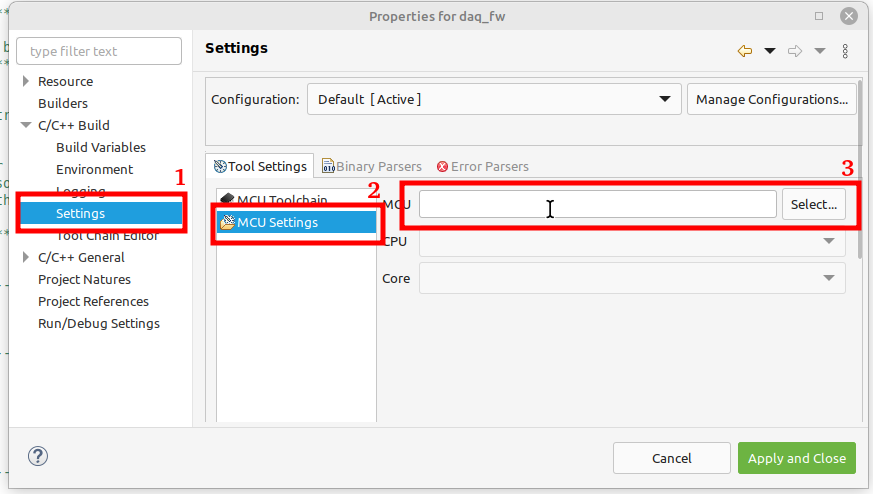

# Docker образ для gcc-arm проектов

Базовый образ: `Ubuntu 22.04`

Предустановленые пакеты:

* build-essential
* wget
* sudo

Тулчейн: `gcc-arm-none-eabi-10.3-2021.10-x86_64-linux` с официального [сайта ](https://developer.arm.com/). По умолчанию распакован в `/opt/gcc-arm-none-eabi`.

Основной пользователь: `developer` с доступом к `sudo` и группе `plugdev`.

Создание образа:

```bash
$ docker build -t image-docker-gcc-arm
```

## Описание

В образе реализована система для сборки проектов для ARM микроконтроллеров с использованием тулчейна `gcc-arm-none-eabi`. Подходит для компиляции артефактов CubeMX-based проектов, сгенерированных для системы сборки `Makefile`. 

> __ВАЖНО!__ При изменении конфигурации проекта через `.ioc` файл в генераторе `CubeMX` всегда проверять изменения в `Makefile`, т.к. он тоже перезагружается.

## Использование

Проекты собираются из контейнера через командную строку, в `VS Code` через плагин `Dev Containers` или в среде `CubeIDE`.

Для проектов, создаваемых в `CubeMX` требуется следующая подготовка перед генерацией:

<p align="center">
    
</p>

На шаге `5` допускается выбор копирования всех или только необходимых библиотек HAL внутрь проекта (зависит от реализации целевого проекта).

### Сборка из командной строки

Создание контейнера из образа с монтированием текущей рабочей директории (это директория целевого проекта):

```bash
$ docker container create -v ./source_dir:/home/dest_dir -w /home/dest_dir -i -t --name my_container_name image-docker-gcc-arm
```

Запуск и подключение к контейнеру в интерактивном режиме:

```bash
$ docker container start --attach -i my_container_name
```

Сборка:

```bash
$ make clean
$ make all
```

### Сборка в VS Code

Для работы в `VS Code` должен быть установлен плагин `Dev Containers`. Шаблон конфигурации представлен в `.devcontainer/devcontainer_template.json` (после копирования в свой проект не забыть переименовать шаблон).

При открытии проекта выбрать `Reopen in Container`.



Сборка доступна из терминала контейнера:

```bash
$ make clean
$ make all
```

Или с использованием тасков через плагин `Task Explorer`:



Нативные таски (отмечены красным символом в дереве с именем `make`) отображают все цели проанализированного `Makefile` проекта. Они работают т.к. для `make` выполнено переопределение имени бинарного файла (вместо `nmake`) в `devcontainer.json`:

```json
"taskExplorer.pathToPrograms": {
    "make": "make"
}
```

Для шаблонного примера заведены задачи `vscode` (сборка и программирование), а также настройки для работы плагина отладки, автодополнений и запуска отладчика `OpenOCD`. Все файлы конфигурации находятся в директории `project_templates`. Для использования: скопировать все директории из `project_templates` в корень своего проекта. 

### Сборка в CubeIDE

В среду `CubeIDE` проект импортируется, как `Makefile`-проект.

<p align="center">
    
    
    
</p>

Для выполнения отладки необходимо дополнительно сконфигурировать среду, указав целевой микроконтроллер в свойствах проекта.

<p align="center">
    
</p>


## CI

В проекте присутствует скрипт-шаблон для сборки Docker-образа в GitLab CI.